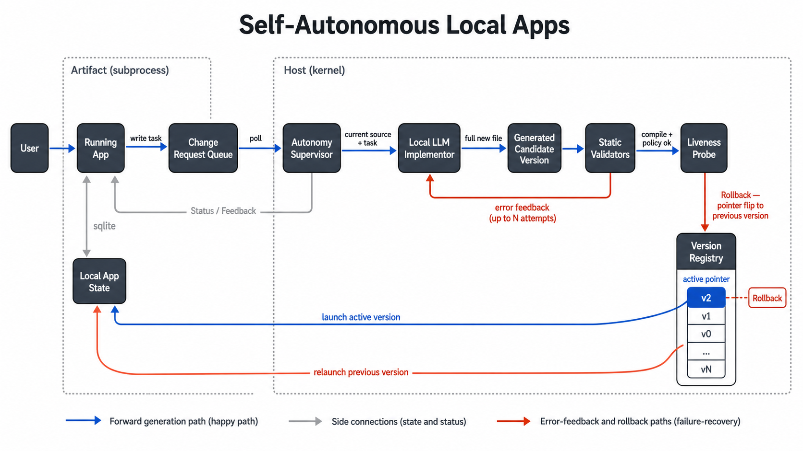

# Loopa

A small SDK for self-extending desktop apps. Drop in a hand-written `v0`, type a change request inside the running app, and the supervisor regenerates `v1` from a local LLM, validates it, swaps versions, and rolls back if it crashes.



The first consumer is a Tk calculator under [apps/calculator/](apps/calculator/). The framework itself is in [loopa/](loopa/).

## Three roles

- **Supervisor** ([loopa/host/supervisor.py](loopa/host/supervisor.py)) — long-running host. Launches the artifact, polls the task inbox, calls the implementor, validates, swaps versions, watches startup, rolls back.
- **Artifact** ([apps/<name>/versions/vN/main.py](apps/calculator/versions/v0/main.py)) — the actual app, launched as a subprocess. Imports only `loopa.artifact.*`.
- **Implementor** ([loopa/host/implementor.py](loopa/host/implementor.py)) — generates the next artifact from the current source + user task. Default ships an Ollama backend.

IPC between supervisor and artifact is plain files in `apps/<name>/runtime/`:

- `registry.json` — current version pointer
- `status.json` — supervisor → artifact status line
- `tasks.jsonl` — artifact → supervisor task queue (append-only)

## Loop

1. User types a request → `loopa.artifact.chat.send_task` ([loopa/artifact/chat.py:40](loopa/artifact/chat.py:40)) appends to `tasks.jsonl`.
2. Supervisor polls ([loopa/host/supervisor.py:138](loopa/host/supervisor.py:138)), allocates `versions/vN+1/`, calls `implementor.generate(...)`.
3. Validators run in order against `vN+1/`: compile + token policy. Each failure feeds back as `previous_error` for the next implementor attempt (up to `max_attempts`).
4. Supervisor stops the old artifact, flips the registry, launches `vN+1`, and runs the probe.
5. Probe failure → rollback to `vN`. Probe ok → status `ready`.
6. ≥3 artifact crashes within 10s → supervisor fail-stops.

## Kernel vs pluggables

The supervisor itself knows nothing about Python, Tk, or calculators. Five interfaces are pluggable per app:

| Plug point | Default | Lives in |
|---|---|---|
| `Runner` — how to launch / stop the artifact | `PythonRunner` (with optional Tk preflight) | [runner.py](loopa/host/runner.py) |
| `Probe` — "is the new version actually working?" | `ProcessAliveProbe(window_seconds=10)` | [probe.py](loopa/host/probe.py) |
| `Validator` — static gates against generated code | `CompilePythonValidator`, `TokenPolicyValidator` | [validator.py](loopa/host/validator.py) |
| `Implementor` — produces the next artifact | `OllamaImplementor` | [implementor.py](loopa/host/implementor.py) |
| `loopa.artifact.*` — surface the artifact may import | `chat.send_task`, `chat.read_status`, `state.connect` | [loopa/artifact/](loopa/artifact/) |

The kernel ([loopa/host/](loopa/host/)) owns: registry, version dir allocation, task inbox + dedupe, atomic writes, the launch/watch/swap loop, and retry-with-error-feedback orchestration.

## Quick start

Requires Python 3.11+ with Tkinter:

```bash
python3 -c "import tkinter; print('tkinter ok')"
```

Start Ollama with a model that can write Python:

```bash
ollama run gemma4:latest
```

Run the calculator:

```bash
python -m loopa run apps/calculator/
```

Type a change request in the bottom box (e.g. "add a percentage button") and press Send. Watch `apps/calculator/logs/supervisor.log`.

## Repository layout

```
loopa/                       # the SDK
├── host/                    # the kernel — never imported by artifacts
│   ├── supervisor.py        # the loop
│   ├── registry.py inbox.py status.py versions.py atomic.py paths.py
│   ├── runner.py            # Runner protocol + PythonRunner
│   ├── probe.py             # Probe protocol + ProcessAliveProbe
│   ├── validator.py         # Validator protocol + CompilePython, TokenPolicy
│   ├── implementor.py       # Implementor protocol + OllamaImplementor
│   ├── config.py            # app.toml → AppSpec
│   └── cli.py               # `loopa run <app_dir>`
└── artifact/                # the only namespace artifacts may import
    ├── chat.py              # send_task, read_status
    └── state.py             # sqlite connect()

apps/
└── calculator/              # first consumer
    ├── app.toml             # app spec
    ├── prompt.md            # implementor system prompt
    ├── versions/v0/main.py  # hand-written seed artifact
    ├── runtime/             # generated: registry.json, status.json, tasks.jsonl, state.db
    └── logs/                # generated: supervisor.log, artifact.log
```

## Adding a new app

Three files, one directory:

```
apps/<name>/
├── app.toml
├── prompt.md
└── versions/v0/main.py
```

`app.toml` minimum:

```toml
name = "notes"
entry = "main.py"
seed_version = "v0"

[runner]
kind = "python-tk"           # or "python"

[implementor]
kind = "ollama"
model = "gemma4:latest"
prompt = "prompt.md"

[validator.token_policy]
required = ["send_task(", "read_status("]
forbidden = ["eval(", "exec(", "subprocess", "import loopa.host"]
```

`v0/main.py` is hand-written, imports `from loopa.artifact.chat import send_task, read_status`, and shows a visible change-request input. `prompt.md` is the system prompt the implementor sends to the LLM along with the current source and the user task.

Run with:

```bash
python -m loopa run apps/<name>/
```

## Artifact contract

Every generated `main.py` must:

- import only `loopa.artifact.*` from the framework (never `loopa.host`)
- expose a visible change-request input that calls `send_task(task)`
- poll `read_status()` and display the supervisor message
- run as a normal Python script (the supervisor sets `PYTHONPATH`, `LOOPA_APP_ROOT`, `LOOPA_RUNTIME`, `LOOPA_ARTIFACT_LOG` before launch)
- derive its version from `Path(__file__).resolve().parent.name`
- pass whatever `[validator.token_policy]` the app's `app.toml` specifies

`manifest.json` is written by the supervisor, not the LLM.

## Validation gate

Layered, fail-fast, error feedback:

1. Implementor extracts one fenced Python block from the model response.
2. `CompilePythonValidator` runs `compile()` on the entry file in a subprocess.
3. `TokenPolicyValidator` enforces the per-app forbidden / required substring lists.
4. Supervisor stops old, flips registry, launches new.
5. `Probe.check(process)` — default is "process stays alive for 10s."
6. Any failure produces an error string; the next implementor attempt sees it as `previous_error` and is asked to fix that specific failure. Up to `max_attempts`.
7. Probe failure rolls back to the previous version directory and registry pointer.

## Known limitations

- Validators are substring-based, not AST — `"eval("` in a string literal false-positives; `getattr(__builtins__, "ev"+"al")` slips through.
- Probe only checks process liveness, not that the UI actually rendered.
- One-file artifacts only. Multi-file artifacts would need changes to the implementor and validators.
- No per-version venvs. All versions share the same Python and the same SQLite database.
- `tasks.jsonl` is append-only and re-read on every poll tick.
- ≥3 crashes within 10s exits the supervisor entirely; no auto-rollback to last-known-good across versions.
- Assumes trusted local execution. The token-policy gate is a substring scan, not a sandbox.

## Why versioned artifacts

- A bad version doesn't destroy the previous one.
- Rollback is a registry pointer flip.
- Generated code is inspectable on disk.
- `v0`, `v1`, `v2` is a natural boundary for future test, audit, and migration tooling.

## Design principle

The pattern: **a host process manages immutable app artifacts; an implementor produces new artifacts from user intent; the host validates, switches, and rolls back.**

That's not calculator-specific. The calculator is one app spec under `apps/`. Same engine works for notes, habit trackers, single-purpose dashboards, domain-specific calculators — anything small enough that "regenerate the whole file" is cheaper than "patch."

Keep the artifact-side surface small (every method is LLM attack surface), keep artifacts complete (no half-files, no patches), keep the supervisor boring (validate, launch, watch, roll back).
